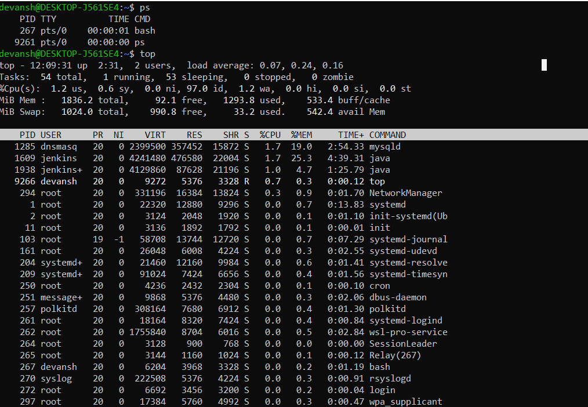

# Process and Services Commands
## To check Process ruuning
- `ps`: displays info about selection of active process
- `top`: shows linux processes an dprovide real time view of running system process or thread
- `htop`: It is horixzontal top and it displays the output in color coded way, shows PID, CPU usage, Command etc.

Output:



______________________________________________________

## Systemd service
- `systemctl` - It stands for system controller
This allows you to check if the service is running or not .

`command`: $ systemctl status {service-name} 
Example - systemctl status docker or systemct ststus ssh

### Output
```
$ systemctl status ssh
● ssh.service - OpenBSD Secure Shell server
     Loaded: loaded (/usr/lib/systemd/system/ssh.service; disabled; preset: enabled)
     Active: active (running) since Sun 2026-02-01 04:56:21 UTC; 8h ago
TriggeredBy: ● ssh.socket
       Docs: man:sshd(8)
             man:sshd_config(5)
    Process: 1799 ExecStartPre=/usr/sbin/sshd -t (code=exited, status=0/SUCCESS)
   Main PID: 1802 (sshd)
      Tasks: 1 (limit: 2191)
     Memory: 4.0M (peak: 5.4M swap: 4.0K swap peak: 4.0K)
        CPU: 681ms
     CGroup: /system.slice/ssh.service
             └─1802 "sshd: /usr/sbin/sshd -D [listener] 0 of 10-100 startups"

Feb 01 04:56:20 DESKTOP-J561SE4 systemd[1]: Starting ssh.service - OpenBSD Secure Shell server...
Feb 01 04:56:21 DESKTOP-J561SE4 sshd[1802]: Server listening on 0.0.0.0 port 22.
Feb 01 04:56:21 DESKTOP-J561SE4 sshd[1802]: Server listening on :: port 22.
Feb 01 04:56:21 DESKTOP-J561SE4 systemd[1]: Started ssh.service - OpenBSD Secure Shell server.
Feb 01 04:56:23 DESKTOP-J561SE4 sshd[1804]: Accepted publickey for jenkins-agent from 127.0.0.1 port 35906 ssh2: ED2551>
Feb 01 04:56:23 DESKTOP-J561SE4 sshd[1804]: pam_unix(sshd:session): session opened for user jenkins-agent(uid=1001)
```

