# Docker Compose: Real-World Multi-Container Apps 
(ctrl + shift + v ) : to preview .md file
-----------------------
### Task 1 — Build Your Own App Stack
**Goal**

Create a 3-service stack:

1️⃣ Web application
2️⃣ Database
3️⃣ Redis cache

This simulates real production architecture.

**Architecture We Build**

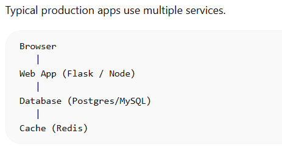
Each service runs in its own container but communicates through a Docker network.

**Step-1 : Project Structure**

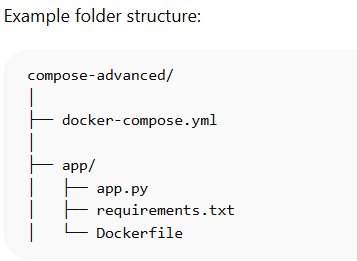

**Step 2 — Create a Simple Web App (Flask)**

app/app.py
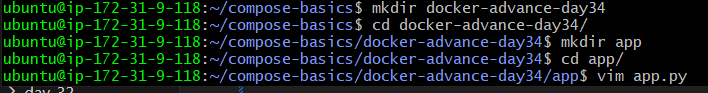

```
from flask import Flask
import mysql.connector
import redis
import os

app = Flask(__name__)

@app.route("/")
def hello():

    db = mysql.connector.connect(
        host="db",
        user="user",
        password="password",
        database="mydb"
    )

    r = redis.Redis(host="redis", port=6379)

    return "Hello from Flask + MySQL + Redis!"

if __name__ == "__main__":
    app.run(host="0.0.0.0", port=5000)
```
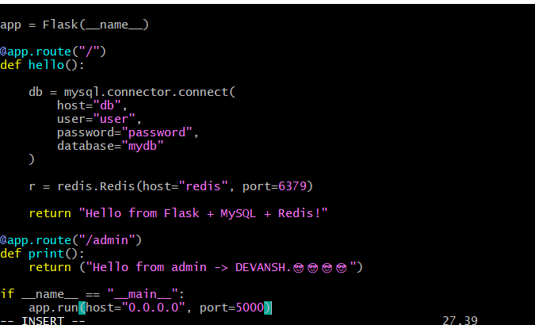

**Step 3 — requirements.txt**

```
flask
mysql-connector-python
redis
```
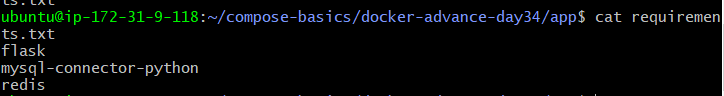

**Step 4 — Create Dockerfile for App**

app/dockerfile

```
FROM python:3.10

WORKDIR /app

COPY requirements.txt .

RUN pip install -r requirements.txt

COPY . .

CMD ["python", "app.py"]
```
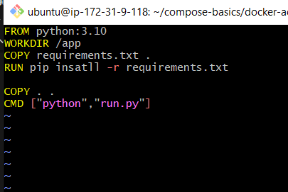

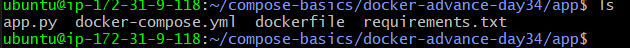

**Step 5 — docker-compose.yml**

3 Services : Flask, Database & Redis
```
version: "3.9"

services:

  web:
    build: ./app
    ports:
      - "5000:5000"
    depends_on:
      - db
      - redis

  db:
    image: mysql:8
    environment:
      MYSQL_ROOT_PASSWORD: root
      MYSQL_DATABASE: mydb
      MYSQL_USER: user
      MYSQL_PASSWORD: password
    volumes:
      - mysql-data:/var/lib/mysql

  redis:
    image: redis:latest

volumes:
  mysql-data:
```

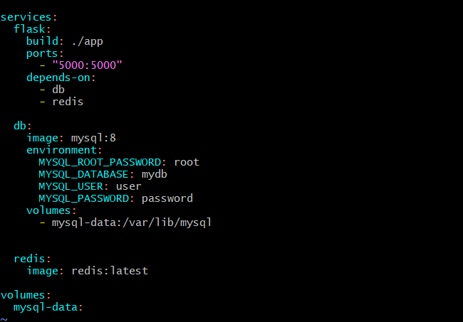

**How to Start**

`docker compose up --build`

`http://localhost:5000` : Run on local browser

`Output from / and /admin`

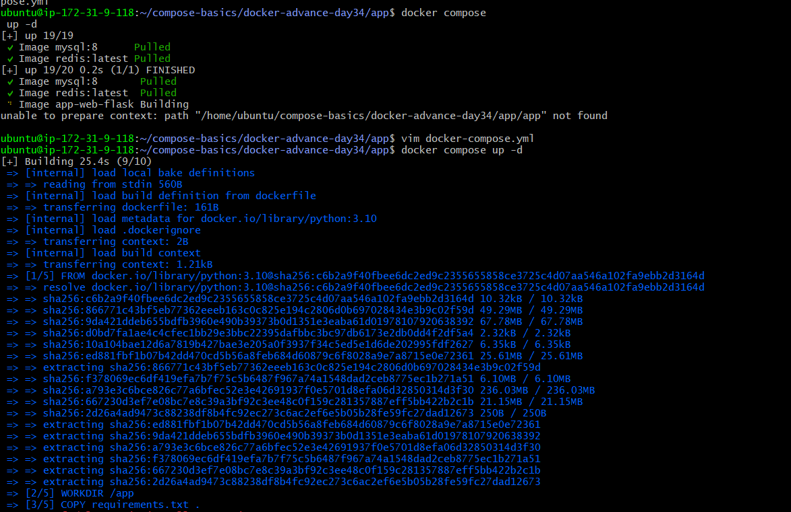

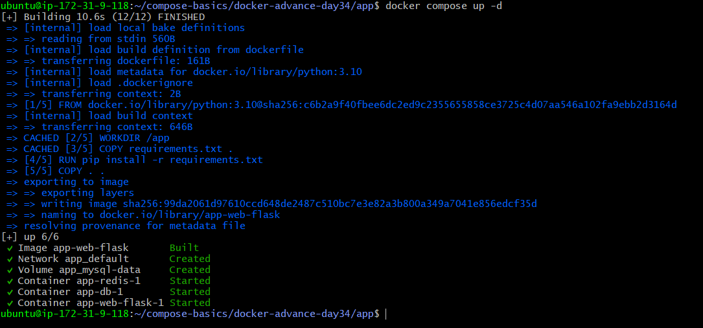

Browser:

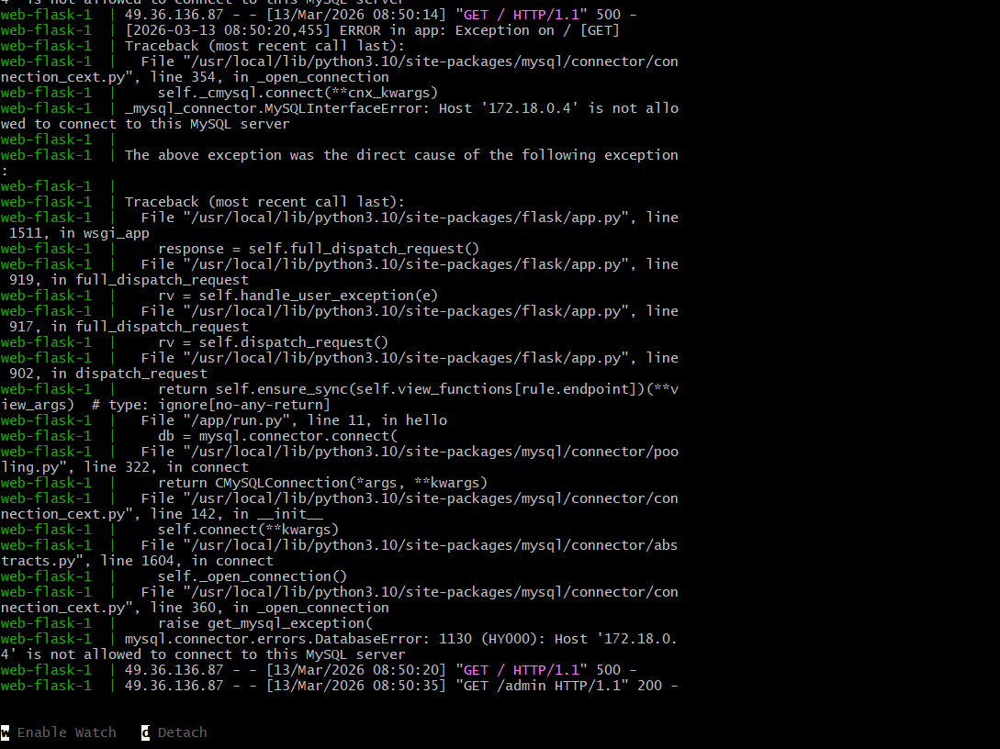

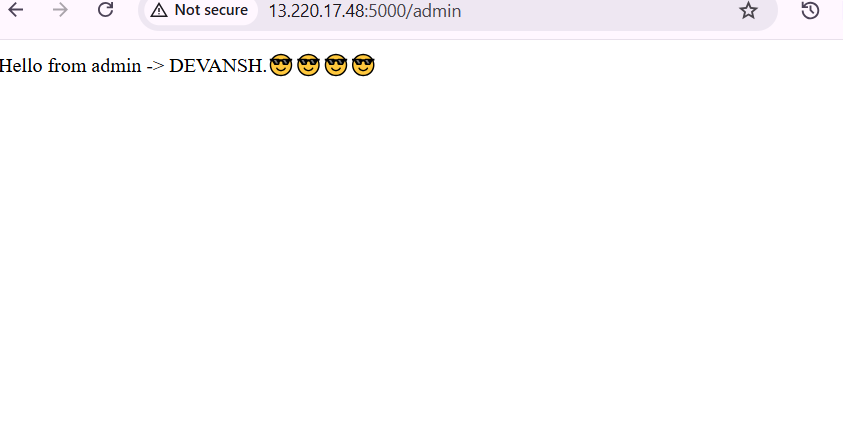

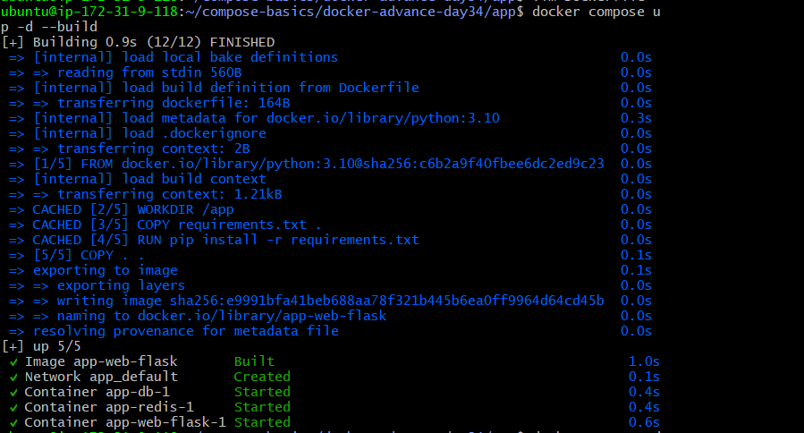

----

# Task 2 — depends_on & Healthchecks

**Problem**

Containers may start but services inside them may not be ready.

Example:

* MySQL container starts

* MySQL service not ready yet

* App tries to connect

* App crashes


**Step 1 — Add Healthcheck for MySQL**

update sevice: 

```
healthcheck:
    test: ["CMD", "mysqladmin" ,"ping","-h","localhost"]
    interval: 10s
    timeout: 5s
    retries: 5
```

Explanation

Parameter |	Meaning

test	  | Command to check DB status

interval  | How often healthcheck runs

timeout	  | Max wait time

retries	  | Fail attempts before unhealthy

**Step 2 — Wait for Healthy Database**

*Modify web service:*

```
web:
  build: ./app
  ports:
    - "5000:5000"
  depends_on:
    db:
      condition: service_healthy
```
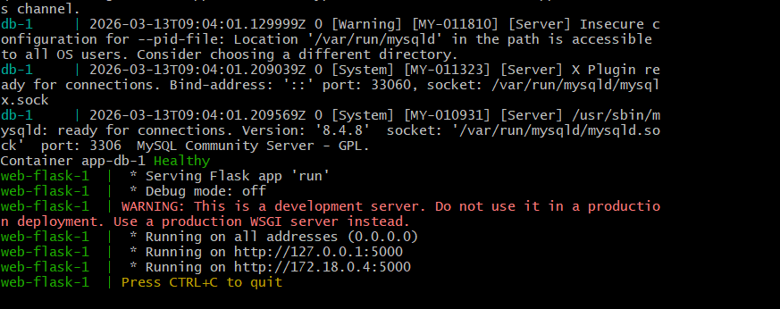

**Now the web container waits until MySQL is healthy.**

### Test

`docker compose down`

`docker compose up or docker compose up -d --build`


**Task 3 — Restart Policies**

Containers may crash in production.

Restart policies allow automatic recovery.

* If container stops → restart automatically

```
db:
  image: mysql:8
  restart: always or on-failure
```
**Diffrence btw restart : always and on-failure**

`restart:   always`	 : Restart every time. Ex **Database**
`restart:   on-failure`	: Restart only if container crashes. ex **Web Services**
`restart:   unless-stopped` : Restart unless manually stopped. ex **Batch jobs**

----------

# Task 4: Custom Dockerfiles in Compose

Instead of using prebuilt images, Compose can **build images from Dockerfiles.**

**We have used it :**

`build: .`: build image from dockerfile inside current repo. 

If docker compose outside the /app folder than we will write `build: ./` means al the files are present in `/app` directory.

------

# Task 5 — Named Networks & Volumes

By default Compose creates a default network, but production setups define explicit networks.

We can name a network <backend> and for all three flask, database and redis , they need to be on same network so that they can communicate with each other.

* At the bottoom like volume we write:

* Newtorkk:
  
```
network:
    backend:
```

* Volume::
  
```
volumes:
 - mysql-data:/var/lib/mysql

at bottom -->
volumes:
  mysql-data:

```
* In the services we can write:

```
services:

  web:
    networks:
      - backend

  db:
    networks:
      - backend

  redis:
    networks:
      - backend
```

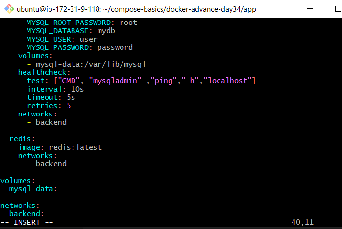

You can see network created:

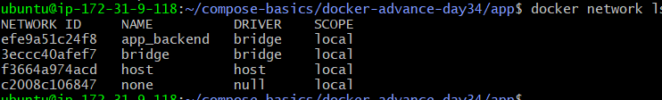

---------------

# Task 6 — Scaling

It iss the process of running multiple instances (replicas) of a specific service to manage increased traffic, improve performance through load distribution, and ensure high availability. 

This is a form of **horizontal scaling**, where you add more containers rather than increasing the resources of a single container.

### How to Scale

**Using the docker compose up Command**

```
docker compose up --scale <service_name>=<number_of_instances> -d
```

Command:

```
docker compose up --scale web=3 -d
```

*This command will create three separate containers for the web service (e.g., web-1, web-2, web-3), which can be verified using docker compose ps. *

### Considerations for Scaling

* **Port Mapping** : When scaling a service that maps a specific host port, you must use a port range in your compose.yaml file to avoid port conflicts (as multiple containers cannot bind to the same host port).

* **Stateless Services** : Scaling works best with stateless applications or microservices where the workload can be distributed across multiple, independent instances.

* **Docker Swarm** : For production environments and more advanced scaling features, such as the deploy section in the Compose file, Docker Swarm or Kubernetes is typically used. 

> In my example, I will make replicas of flask app . Where I will assign container port and host post will be allocated by the Docker randomly. See below >>>

```
web-flask:
    build: .
    ports:
      - "5000"

```

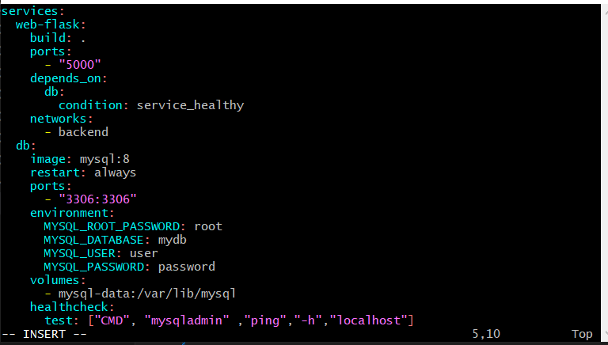

- Docker assign ports randomlt to web-flask:
  
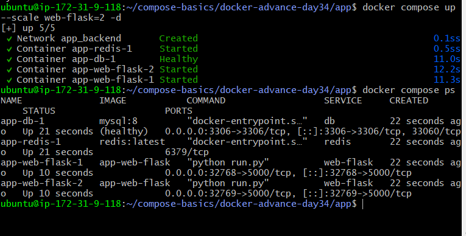

- Created inbound rules:
  
  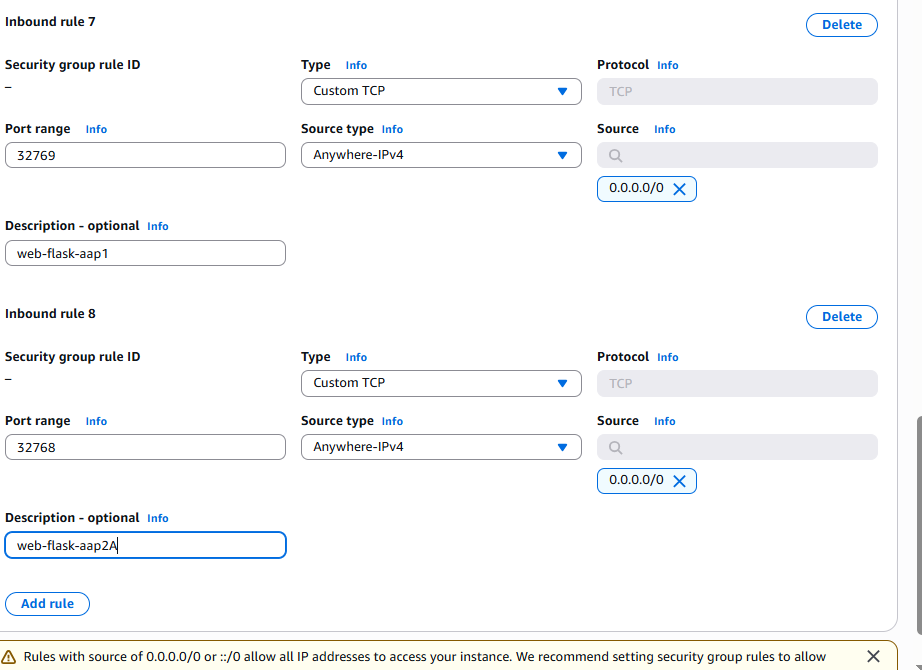

- REPLICAS MADE ><><>< 😍😎:
  
  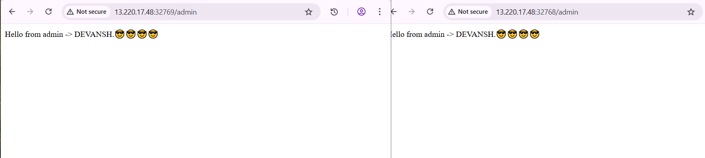

  