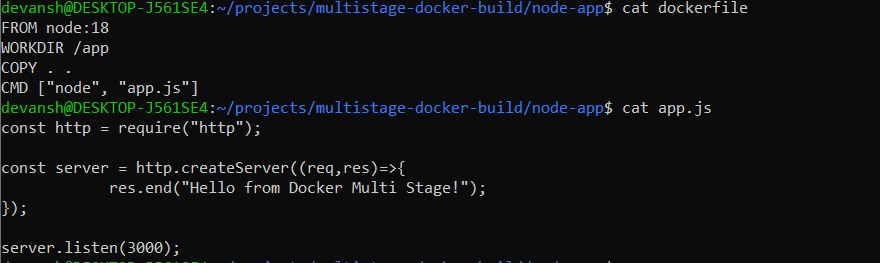
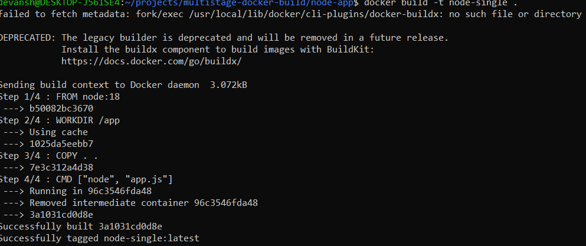
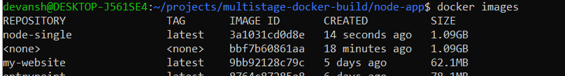
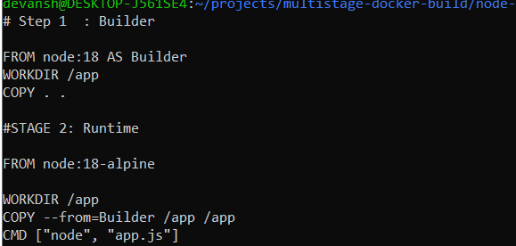
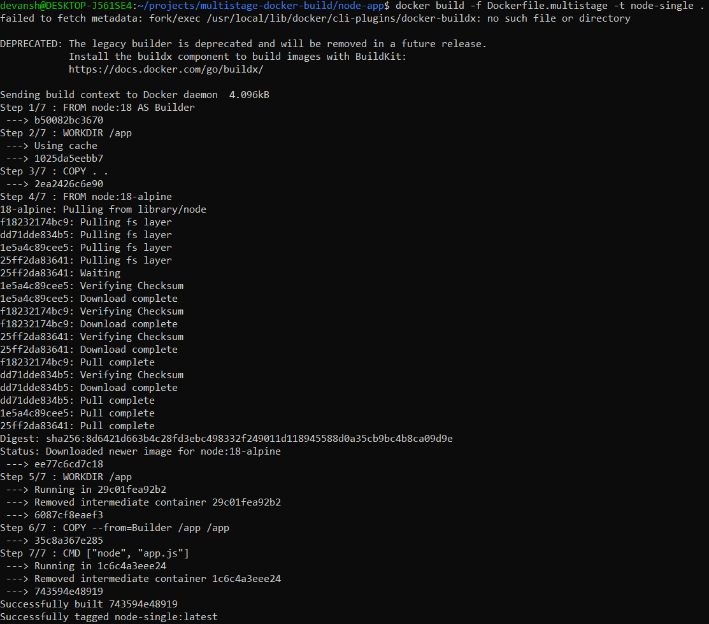
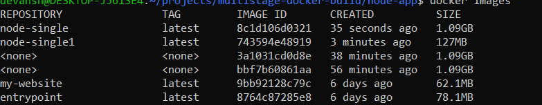
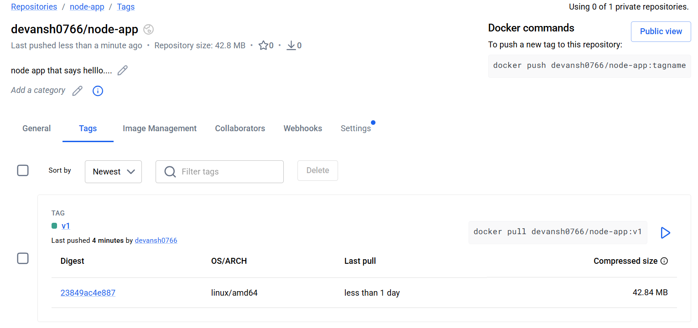
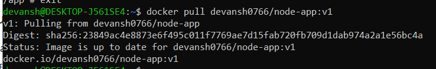
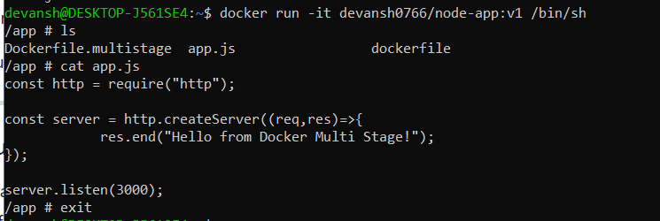

# Multi-Stage Builds & Docker Hub

**Multi-Stage Builds & Docker Hub**

Learn how to:

* Reduce Docker image size
* Build optimized images using multi-stage builds
* Push and distribute images through Docker Hub
*  Follow Docker image best practices

----------------

## Task 1 — The Problem with Large Images

Objective

Understand why normal **Docker images become large.**

When we build apps normally, the image contains:

* build tools
* compilers
* dependencies
* source code
* runtime

All of these increase **image size.**

### Step 1 — Create a Simple Node.js App

- Create folder:

```
mkdir node-app
cd node-app
```

- Create file:

app.js

```
const http = require("http");

const server = http.createServer((req,res)=>{
    res.end("Hello from Docker Multi Stage!");
});

server.listen(3000);
```


### Step 2 — Create a Single-Stage Dockerfile

```
FROM node:18

WORKDIR /app

COPY . .

RUN npm install

CMD ["node","app.js"]
```

### Step 3 — Build Image

`docker build -t node-single .`



### Step 4 — Check Image Size

`docker images`



Example output:

`node-single    950MB`

**Large size happens because:**

* Node image

* build tools

* npm cache

* development files

**Why This Is Bad**

Large images cause:

* slow deployments

* slow CI/CD pipelines

* higher storage usage

* larger security attack surface

-------------------------

## Step 2 — Create a Single-Stage Dockerfile

**Objective**

Separate build **stage** and **runtime stage.**

This means:

Stage 1 → copy/build the app
Stage 2 → run the app in a smaller base image

Multi-stage dockerfile :

```
# Stage 1: Builder
FROM node:18 AS builder

WORKDIR /app
COPY . .

# Stage 2: Runtime
FROM node:18-alpine

WORKDIR /app

COPY --from=builder /app /app

CMD ["node", "app.js"]
```


### What Happens Here

**Stage 1 — Builder**

`FROM node:18 AS builder`

Docker creates a temporary image called builder and copies your app.

**Stage 2 — Runtime**

`FROM node:18-alpine`

node:18-alpine is much smaller because Alpine Linux is lightweight.

Then we copy only the needed files:

`COPY --from=builder /app /app`

The builder image is discarded, leaving a smaller final image.

**Build the Multi-Stage Image**

`docker build -f Docker.multistage -t node-single .`



**Compare Image Sizes**

Run:

`docker images`



```
Difference : `node-single` : 1.09GB  && `node-single1` : 127M

```

### Why Multi-Stage Images Are Smaller

Because the final image contains only:

* runtime environment

* compiled application

Not:

* build dependencies

* compilers

* temporary files

------

## Task 3 — Push Image to Docker Hub

1. **Login From Terminal :**

```
docker login

-> Enter code and login
```


2. **Tag the image :**

```
docker tag node-single1(image name) <dockerhub-name>/repo-name:v1
```

3. **Push the image :**

```
docker push <dockerhub-name>/repo-name:v1
```

4. **To Pull Image :**

```
docker push <dockerhub-name>/repo-name:v1
```



5. **Run the Container :**

```
docker run -d -p 3000:3000 --name my-node-app
```
-------

**CHECK IN INTERACTIVE SHELL::**



-------

