# Docker Project: Dockerize a Full Application

**Task**

**Today's goal is to take a real application and Dockerize it end-to-end.**

**No tutorials. No hand-holding. Pick an app, write the Dockerfile, set up Compose, and ship it. This is what you'll do on the job.**

---------

## What are we going to do??????

We’ll build a **complete production-style project from scratch like a full-stack + DevOps engineer.**

This will include:

* **Frontend** → simple UI (served by Nginx)

* **Backend API** → Node.js + Express

* **Database** → MongoDB

* **Reverse Proxy** → Nginx

* **Containers** → Docker

* **Orchestration** → Docker Compose

By the end you will have a **real full-stack Dockerized application** you can push to GitHub and Docker Hub.

----------------------------

### Project Architecture


-------------

## STEP 1 — Create Project Folder

- Create the project directory.

```
mkdir docker-fullstack-app
cd docker-fullstack-app
```

- Create folders.
  
```
mkdir backend
mkdir nginx
mkdir frontend
```

- Project Structure:
  
```
docker-fullstack-app
│
├── backend
├── frontend
├── nginx
├── docker-compose.yml
├── .env
└── README.md
```
## STEP 2 — Build Backend (Node.js API)

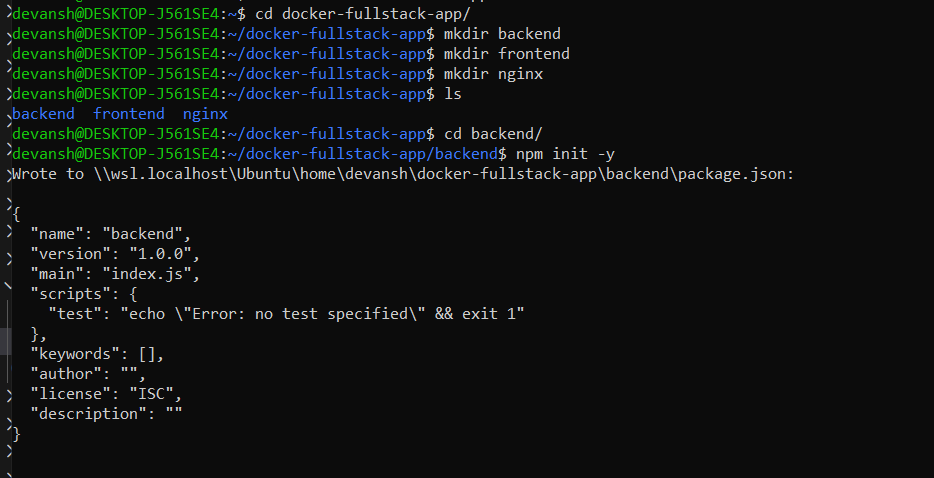

**created backend API**

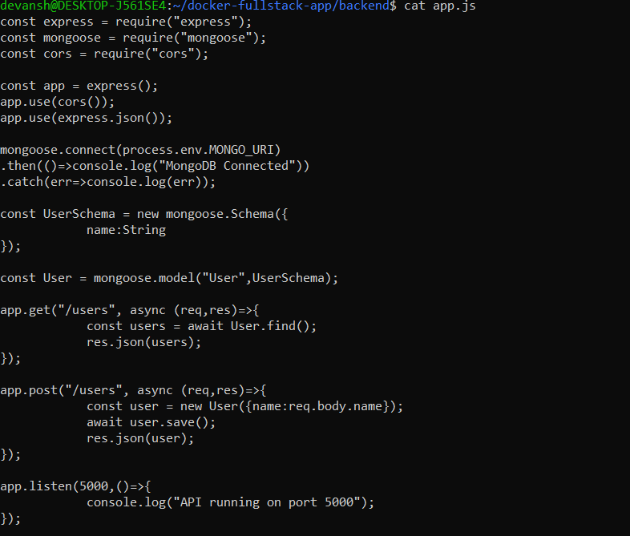


## STEP 3 — Backend Dockerfile

- created /backend/dockerfile

```
FROM node:18-alpine

WORKDIR /app

COPY package*.json ./

RUN npm install

COPY . .

EXPOSE 5000

CMD ["node","app.js"]
```

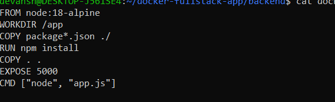

## STEP 4 — Create Frontend

- Created html file in /frontend/index.htm

```
<!DOCTYPE html>
<html>
<head>
<title>Docker Fullstack App</title>
</head>

<body>

<h1>User Manager</h1>

<input id="username" placeholder="Enter name"/>
<button onclick="addUser()">Add User</button>

<ul id="users"></ul>

<script>

async function loadUsers(){
    const res = await fetch("/api/users");
    const users = await res.json();

    const list = document.getElementById("users");
    list.innerHTML="";

    users.forEach(u=>{
        const li=document.createElement("li");
        li.innerText=u.name;
        list.appendChild(li);
    });
}

async function addUser(){
    const name=document.getElementById("username").value;

    await fetch("/api/users",{
        method:"POST",
        headers:{"Content-Type":"application/json"},
        body:JSON.stringify({name})
    });

    loadUsers();
}

loadUsers();

</script>

</body>
</html>
```

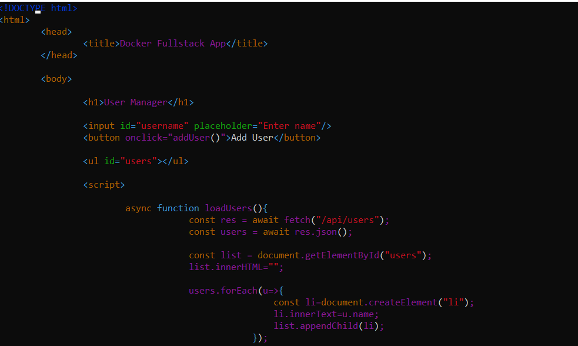

- Frontend will call backend via:
- `/api/users`
  

## STEP 5 — Configure Nginx

- create /nginx.nginx.conf
  
```
events {}

http {

server {

listen 80;

location / {
root /usr/share/nginx/html;
index index.html;
}

location /api/ {
proxy_pass http://backend:5000/;
}

}

}
```
  
  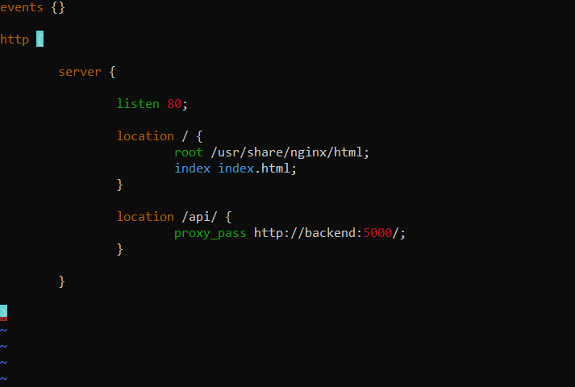

* **Explanation:**

```
/ → serve frontend
/api → forward request to backend container

```

## STEP 6 — Docker Compose

- create dockercompose inside /full-stack folser:

```
version: "3.8"

services:

  mongo:
    image: mongo:6
    container_name: mongo_db
    volumes:
      - mongo-data:/data/db
    networks:
      - app-network

  backend:
    build: ./backend
    container_name: node_backend
    environment:
      - MONGO_URI=mongodb://mongo:27017/mydb
    depends_on:
      - mongo
    networks:
      - app-network

  nginx:
    image: nginx:alpine
    container_name: nginx_server
    ports:
      - "80:80"
    volumes:
      - ./frontend:/usr/share/nginx/html
      - ./nginx/nginx.conf:/etc/nginx/nginx.conf
    depends_on:
      - backend
    networks:
      - app-network

networks:
  app-network:

volumes:
  mongo-data:
```
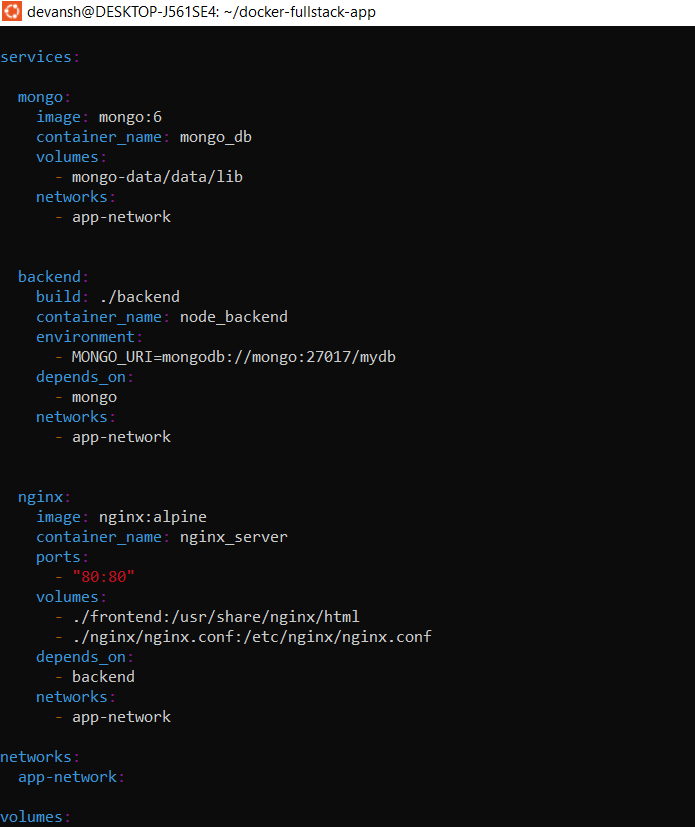

## STEP 7 — Environment Variables

- Create .env
  
  `MONGO_URI=mongodb://mongo:27017/mydb`

## STEP 8 — Docker Ignore

- create `.dockerignore`

```
node_modules
.git
.env
```
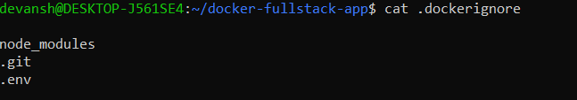

## STEP 9 — Run the Project

- From root folder:

```
docker compose up --build
```
- Docker will start:

```
mongo_db
node_backend
nginx_server
```
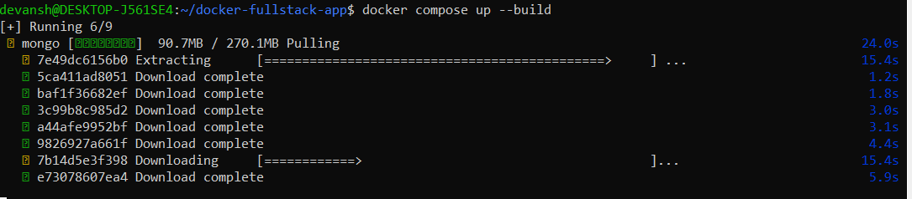


### Docker compose up --build

## STEP 10 — Test the Application
1.

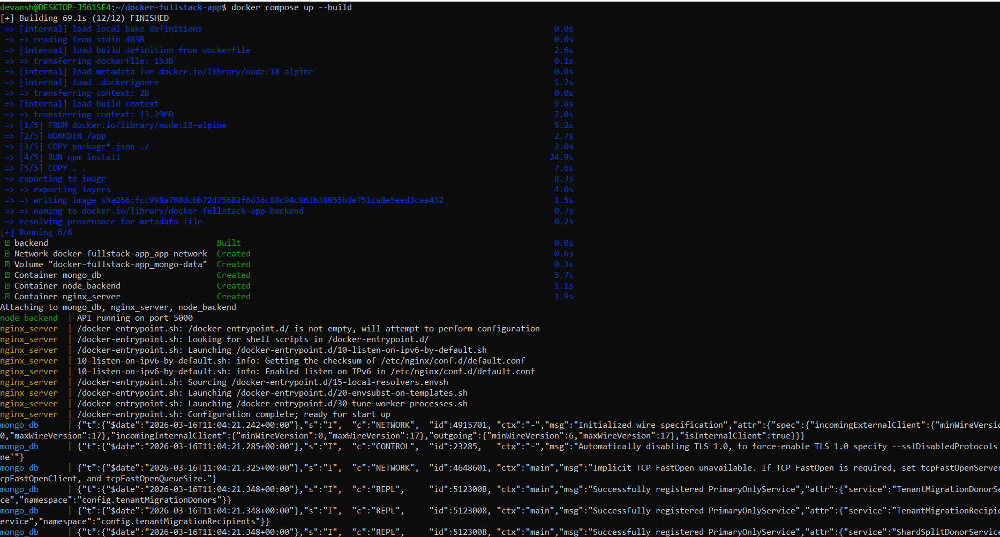

2.

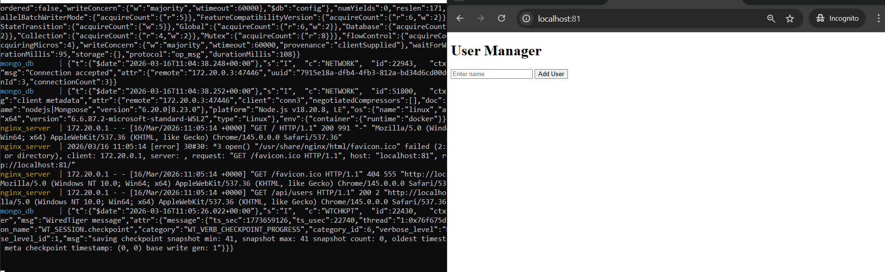

3.

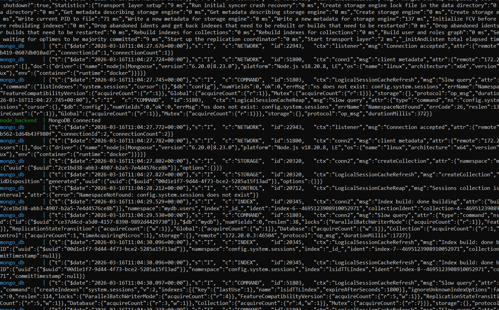

4. On `/api/users` user shows:
   
   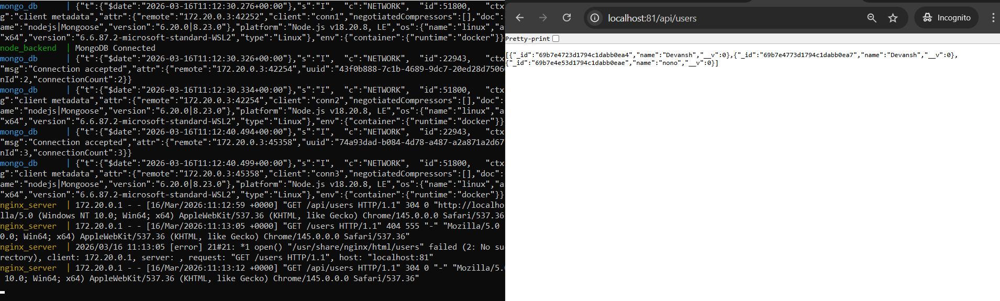

------

## STEP 11 — Push Backend Image to Docker Hub

- Login:
 
 `docker login`

- BUild Image: 

`docker build -t yourusername/docker-backend ./backend`


- Tag image:

`docker tag yourusername/docker-backend yourusername/docker-backend:v1`

- Push Image:

`docker push yourusername/docker-backend:v1`


**Updated Docker-compose.yml**


