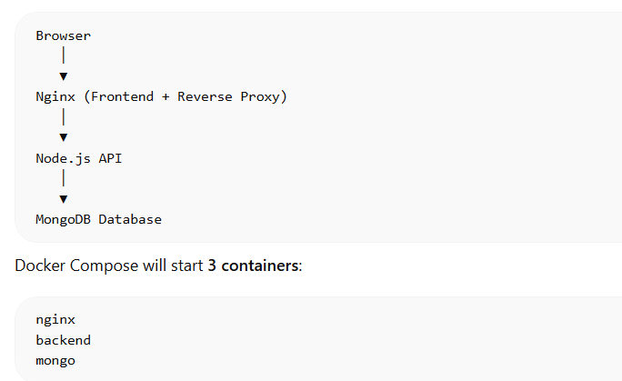

# Docker Project: Dockerize a Full Application

**Task**

**Today's goal is to take a real application and Dockerize it end-to-end.**

**No tutorials. No hand-holding. Pick an app, write the Dockerfile, set up Compose, and ship it. This is what you'll do on the job.**

---------

## What are we going to do??????

We’ll build a **complete production-style project from scratch like a full-stack + DevOps engineer.**

This will include:

* **Frontend** → simple UI (served by Nginx)

* **Backend API** → Node.js + Express

* **Database** → MongoDB

* **Reverse Proxy** → Nginx

* **Containers** → Docker

* **Orchestration** → Docker Compose

By the end you will have a **real full-stack Dockerized application** you can push to GitHub and Docker Hub.

----------------------------

### Project Architecture



-------------

## STEP 1 — Create Project Folder

- Create the project directory.

```
mkdir docker-fullstack-app
cd docker-fullstack-app
```

- Create folders.
  
```
mkdir backend
mkdir nginx
mkdir frontend
```

- Project Structure:
  
```
docker-fullstack-app
│
├── backend
├── frontend
├── nginx
├── docker-compose.yml
├── .env
└── README.md
```